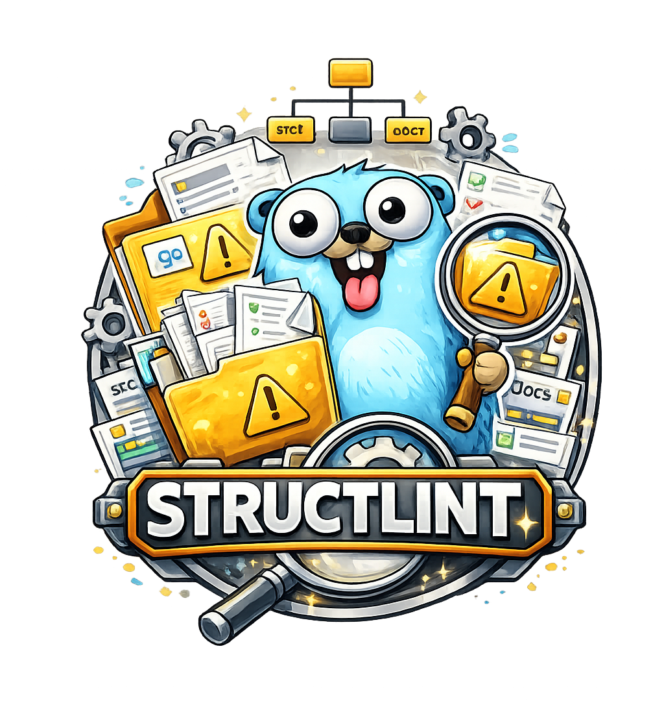

<div align="center">
  
</div>

# structlint

A CLI tool for validating and enforcing directory structure and file naming patterns in your projects.

## Installation

```bash
curl -fsSL https://raw.githubusercontent.com/AxeForging/structlint/main/install.sh | sh
```

<details>
<summary><strong>Other Installation Methods</strong></summary>

### From Binary

Download from [Releases](https://github.com/AxeForging/structlint/releases):

```bash
# Linux (amd64)
curl -LO https://github.com/AxeForging/structlint/releases/latest/download/structlint-linux-amd64.tar.gz
tar -xzf structlint-linux-amd64.tar.gz
sudo mv structlint /usr/local/bin/

# macOS (Apple Silicon)
curl -LO https://github.com/AxeForging/structlint/releases/latest/download/structlint-darwin-arm64.tar.gz
tar -xzf structlint-darwin-arm64.tar.gz
sudo mv structlint /usr/local/bin/

# Windows (PowerShell)
Invoke-WebRequest -Uri "https://github.com/AxeForging/structlint/releases/latest/download/structlint-windows-amd64.zip" -OutFile structlint.zip
Expand-Archive structlint.zip -DestinationPath .
```

### From Source

```bash
git clone https://github.com/AxeForging/structlint.git
cd structlint
make build
./bin/structlint version
```

</details>

### Quality gates with Gauntlet

Gauntlet orchestrates the repository's normal Go checks plus Structlint and Dupehound.
Structlint remains whole-run because structural violations often identify paths rather
than lines; Dupehound is diff-scoped through its source annotations.

```yaml
custom_gates:
  structlint:
    command: ["structlint", "validate", "--format", "github"]
    parser: github-annotations
    line_scoped: false
  dupehound:
    command: ["dupehound", "scan", "--format", "github", "--quiet"]
    parser: github-annotations
    line_scoped: true
```

```sh
gauntlet check
gauntlet check --staged --format agent
```

## Quick Start

```bash
# Create config
cat > .structlint.yaml << 'EOF'
dir_structure:
  allowedPaths: [".", "cmd/**", "internal/**", "pkg/**"]
  disallowedPaths: ["vendor/**", "tmp/**"]
file_naming_pattern:
  allowed: ["*.go", "*.yaml", "*.md", "Makefile"]
  disallowed: ["*.env*", "*.log"]
ignore: [".git", "vendor", "bin"]
EOF

# Validate
structlint validate
```

**Output:**
```
--- Validation Summary ---
✓ 42 files/directories passed validation
✗ 0 violations found
🎉 All files and directories comply with the rules!
```

## Why structlint?

| Problem | Solution |
|---------|----------|
| Inconsistent project structure across team | Enforce allowed/disallowed paths |
| Sensitive files committed (.env, keys) | Block forbidden file patterns |
| Missing essential files (README, configs) | Require specific files |
| Files drifting into the wrong layer | Enforce placement rules |
| Packages missing local entrypoints/docs | Enforce required groups |
| Cross-layer imports creeping in | Enforce Go, JS/TS, and Python boundaries |
| AI tools placing files incorrectly | Clear structure rules for AI context |
| CI/CD structural compliance | JSON/SARIF/GitHub reports + exit codes |

## Configuration

<details>
<summary><strong>Complete Configuration Reference</strong></summary>

```yaml
# .structlint.yaml

# Directory structure rules
dir_structure:
  # Directories that ARE allowed (glob patterns)
  allowedPaths:
    - "."              # Root directory
    - "cmd/**"         # cmd/ and all subdirectories
    - "internal/**"    # internal/ and all subdirectories
    - "pkg/**"         # pkg/ and all subdirectories
    - "test/**"        # test/ and all subdirectories
    - "docs/**"        # docs/ and all subdirectories

  # Directories that are NOT allowed (violations if found)
  disallowedPaths:
    - "vendor/**"      # No vendor directory
    - "node_modules/**"
    - "tmp/**"
    - "temp/**"

  # Directories that MUST exist
  requiredPaths:
    - "cmd"            # Must have cmd/
    - "internal"       # Must have internal/

# File naming rules
file_naming_pattern:
  # Files that ARE allowed (glob patterns)
  allowed:
    - "*.go"
    - "*.mod"
    - "*.sum"
    - "*.yaml"
    - "*.yml"
    - "*.json"
    - "*.md"
    - "*.txt"
    - "Makefile"
    - "Dockerfile*"
    - ".gitignore"
    - ".golangci.yml"

  # Files that are NOT allowed (violations if found)
  disallowed:
    - "*.env*"         # No .env files
    - "*.log"          # No log files
    - "*.tmp"
    - "*.bak"
    - "*~"             # No backup files
    - ".DS_Store"
    - "Thumbs.db"

  # Files that MUST exist
  required:
    - "go.mod"         # Must have go.mod
    - "README.md"      # Must have README
    - "*.go"           # At least one .go file

# Paths to completely skip during validation
ignore:
  - ".git"
  - "vendor"
  - "node_modules"
  - "bin"
  - "dist"
```

</details>

<details>
<summary><strong>Organization Drift Rules</strong></summary>

```yaml
placement:
  - id: migrations-only
    files: ["*.sql"]
    mustBeUnder: ["migrations/**"]

requiredGroups:
  - id: build-entrypoint
    oneOf: ["Makefile", "Taskfile.yml", "justfile"]
  - id: commands-have-main
    eachDirMatching: "cmd/*"
    mustContain: ["main.go"]

boundaries:
  - id: domain-no-infrastructure
    from: "internal/domain/**"
    cannotImport: ["internal/db/**", "internal/http/**"]
```

Boundary rules are language-aware for Go, JavaScript, TypeScript, and Python imports. See [Configuration Reference](docs/user/configuration.md) and [CI/CD Integration](docs/user/ci-cd-integration.md).

</details>

<details>
<summary><strong>Glob Pattern Syntax</strong></summary>

| Pattern | Matches | Example |
|---------|---------|---------|
| `*` | Any characters (not `/`) | `*.go` → `main.go`, `test.go` |
| `**` | Any characters (including `/`) | `cmd/**` → `cmd/app/main.go` |
| `?` | Single character | `test?.go` → `test1.go` |
| `[abc]` | Any char in set | `[mt]est.go` → `test.go`, `mest.go` |
| `[!abc]` | Any char NOT in set | `[!t]est.go` → `best.go` |
| `{a,b}` | Either a or b | `*.{go,md}` → `main.go`, `README.md` |

</details>

## Project Type Examples

<details>
<summary><strong>Go Project</strong></summary>

```yaml
# .structlint.yaml for Go projects
dir_structure:
  allowedPaths:
    - "."
    - "cmd/**"
    - "internal/**"
    - "pkg/**"
    - "api/**"
    - "web/**"
    - "configs/**"
    - "scripts/**"
    - "test/**"
    - "docs/**"
    - ".github/**"
  disallowedPaths:
    - "vendor/**"
    - "tmp/**"
  requiredPaths:
    - "cmd"

file_naming_pattern:
  allowed:
    - "*.go"
    - "*.mod"
    - "*.sum"
    - "*.yaml"
    - "*.yml"
    - "*.json"
    - "*.md"
    - "*.sql"
    - "*.sh"
    - "Makefile"
    - "Dockerfile*"
    - ".gitignore"
    - ".golangci.yml"
    - ".goreleaser.yaml"
    - "go.work"
  disallowed:
    - "*.env*"
    - "*.log"
    - "*.tmp"
    - ".DS_Store"
  required:
    - "go.mod"
    - "README.md"

ignore:
  - ".git"
  - "vendor"
  - "bin"
  - "dist"
```

</details>

<details>
<summary><strong>Node.js / TypeScript Project</strong></summary>

```yaml
# .structlint.yaml for Node.js/TypeScript projects
dir_structure:
  allowedPaths:
    - "."
    - "src/**"
    - "tests/**"
    - "lib/**"
    - "config/**"
    - "scripts/**"
    - "public/**"
    - ".github/**"
  disallowedPaths:
    - "node_modules/**"
    - "dist/**"
    - "build/**"
    - "coverage/**"

file_naming_pattern:
  allowed:
    - "*.ts"
    - "*.tsx"
    - "*.js"
    - "*.jsx"
    - "*.json"
    - "*.yaml"
    - "*.yml"
    - "*.md"
    - "*.css"
    - "*.scss"
    - "*.html"
    - ".gitignore"
    - ".eslintrc*"
    - ".prettierrc*"
    - "tsconfig*.json"
    - "jest.config.*"
    - "vite.config.*"
    - "Dockerfile*"
  disallowed:
    - "*.env*"
    - "*.log"
    - ".DS_Store"
  required:
    - "package.json"
    - "README.md"

ignore:
  - "node_modules"
  - "dist"
  - ".git"
  - "coverage"
```

</details>

<details>
<summary><strong>Python Project</strong></summary>

```yaml
# .structlint.yaml for Python projects
dir_structure:
  allowedPaths:
    - "."
    - "src/**"
    - "tests/**"
    - "docs/**"
    - "scripts/**"
    - "config/**"
    - ".github/**"
  disallowedPaths:
    - "venv/**"
    - ".venv/**"
    - "__pycache__/**"
    - "*.egg-info/**"
    - ".pytest_cache/**"
    - ".mypy_cache/**"

file_naming_pattern:
  allowed:
    - "*.py"
    - "*.pyi"
    - "*.yaml"
    - "*.yml"
    - "*.json"
    - "*.toml"
    - "*.txt"
    - "*.md"
    - "*.ini"
    - "*.cfg"
    - "Makefile"
    - "Dockerfile*"
    - ".gitignore"
    - "pyproject.toml"
    - "setup.py"
    - "setup.cfg"
    - "requirements*.txt"
  disallowed:
    - "*.env*"
    - "*.log"
    - "*.pyc"
    - ".DS_Store"
  required:
    - "README.md"
    - "*.py"

ignore:
  - "venv"
  - ".venv"
  - "__pycache__"
  - ".git"
  - ".pytest_cache"
```

</details>

<details>
<summary><strong>Monorepo</strong></summary>

```yaml
# .structlint.yaml for monorepos
dir_structure:
  allowedPaths:
    - "."
    - "apps/**"
    - "packages/**"
    - "libs/**"
    - "services/**"
    - "tools/**"
    - "scripts/**"
    - "docs/**"
    - "infra/**"
    - ".github/**"
  disallowedPaths:
    - "node_modules/**"
    - "vendor/**"
    - "dist/**"
    - "build/**"
  requiredPaths:
    - "apps"
    - "packages"

file_naming_pattern:
  allowed:
    - "*.go"
    - "*.ts"
    - "*.js"
    - "*.json"
    - "*.yaml"
    - "*.yml"
    - "*.md"
    - "*.toml"
    - "Makefile"
    - "Dockerfile*"
    - ".gitignore"
    - "go.work"
    - "pnpm-workspace.yaml"
    - "turbo.json"
  disallowed:
    - "*.env*"
    - "*.log"
  required:
    - "README.md"

ignore:
  - ".git"
  - "node_modules"
  - "vendor"
  - "dist"
```

</details>

## CLI Reference

```bash
# Basic validation
structlint validate

# With specific config
structlint validate --config .structlint.yaml

# Generate JSON report
structlint validate --json-output report.json

# Verbose output
structlint validate --log-level debug

# Silent mode (exit code only)
structlint validate --silent

# Show version
structlint version

# Shell completions
structlint completion bash > /etc/bash_completion.d/structlint
structlint completion zsh > "${fpath[1]}/_structlint"
structlint completion fish > ~/.config/fish/completions/structlint.fish
```

<details>
<summary><strong>Environment Variables</strong></summary>

| Variable | Description | Example |
|----------|-------------|---------|
| `STRUCTLINT_CONFIG` | Config file path | `.structlint.yaml` |
| `STRUCTLINT_LOG_LEVEL` | Log level | `debug`, `info`, `warn`, `error` |
| `STRUCTLINT_NO_COLOR` | Disable colors | `true` |

</details>

<details>
<summary><strong>Exit Codes</strong></summary>

| Code | Meaning |
|------|---------|
| `0` | Validation passed |
| `1` | Validation failed (violations found) |
| `2` | Configuration error |
| `3` | Runtime error |

</details>

## CI/CD Integration

### GitHub Action

The simplest way to use structlint in CI — no Go setup required:

```yaml
name: Validate Structure
on: [push, pull_request]

jobs:
  structlint:
    runs-on: ubuntu-latest
    steps:
      - uses: actions/checkout@v7
      - uses: AxeForging/structlint@main
        with:
          config: .structlint.yaml
```

<details>
<summary><strong>Action Inputs</strong></summary>

| Input | Description | Default |
|-------|-------------|---------|
| `config` | Path to config file | `.structlint.yaml` |
| `path` | Directory to validate | `.` |
| `json-output` | Path for JSON report | _(none)_ |
| `log-level` | `debug`, `info`, `warn`, `error` | `info` |
| `silent` | Exit code only, no output | `false` |
| `version` | Structlint version to use | _(latest)_ |
| `comment-on-pr` | Post results as a PR comment | `false` |
| `GITHUB_TOKEN` | GitHub token (required for PR comments) | _(none)_ |

</details>

<details>
<summary><strong>Action with JSON Report</strong></summary>

```yaml
- uses: AxeForging/structlint@main
  with:
    config: .structlint.yaml
    json-output: structlint-report.json

- uses: actions/upload-artifact@v4
  if: always()
  with:
    name: structlint-report
    path: structlint-report.json
```

</details>

<details>
<summary><strong>Action with PR Comments</strong></summary>

Posts validation results directly on your pull request and writes a GitHub Actions Job Summary:

```yaml
name: Validate Structure
on:
  pull_request:
    branches: [main]

permissions:
  contents: read
  pull-requests: write

jobs:
  structlint:
    runs-on: ubuntu-latest
    steps:
      - uses: actions/checkout@v7
      - uses: AxeForging/structlint@main
        with:
          config: .structlint.yaml
          comment-on-pr: "true"
          GITHUB_TOKEN: ${{ secrets.GITHUB_TOKEN }}
```

The comment is updated on each push (not duplicated), and includes a collapsible violation details section.

</details>

### Reusable Workflow

For organizations that want a standardized setup across all repos:

```yaml
# In your repo's .github/workflows/structlint.yml
name: Validate Structure
on: [push, pull_request]

jobs:
  structlint:
    uses: AxeForging/structlint/.github/workflows/structlint.yml@main
    with:
      config: .structlint.yaml
```

<details>
<summary><strong>Reusable Workflow Inputs</strong></summary>

| Input | Type | Description | Default |
|-------|------|-------------|---------|
| `config` | `string` | Path to config file | `.structlint.yaml` |
| `path` | `string` | Directory to validate | `.` |
| `json-output` | `string` | Path for JSON report | _(none)_ |
| `log-level` | `string` | `debug`, `info`, `warn`, `error` | `info` |
| `silent` | `boolean` | Exit code only | `false` |
| `version` | `string` | Structlint version | _(latest)_ |
| `upload-report` | `boolean` | Upload JSON report as artifact | `false` |
| `comment-on-pr` | `boolean` | Post results as a PR comment | `false` |

</details>

<details>
<summary><strong>Reusable Workflow with Report Upload</strong></summary>

```yaml
jobs:
  structlint:
    uses: AxeForging/structlint/.github/workflows/structlint.yml@main
    with:
      config: .structlint.yaml
      json-output: report.json
      upload-report: true
```

</details>

<details>
<summary><strong>Manual GitHub Actions (without the action)</strong></summary>

```yaml
name: Validate Structure
on: [push, pull_request]

jobs:
  structlint:
    runs-on: ubuntu-latest
    steps:
      - uses: actions/checkout@v7

      - name: Setup Go
        uses: actions/setup-go@v6
        with:
          go-version: '1.25.x'

      - name: Install structlint
        run: go install github.com/AxeForging/structlint@latest

      - name: Validate structure
        run: structlint validate --json-output report.json

      - name: Upload report
        uses: actions/upload-artifact@v4
        if: always()
        with:
          name: structlint-report
          path: report.json
```

</details>

<details>
<summary><strong>GitLab CI</strong></summary>

```yaml
structlint:
  image: golang:1.24
  stage: test
  script:
    - go install github.com/AxeForging/structlint@latest
    - structlint validate --json-output report.json
  artifacts:
    when: always
    paths:
      - report.json
```

</details>

<details>
<summary><strong>Pre-commit Hook</strong></summary>

Auto-install:

```bash
structlint hook install
```

Or with the [pre-commit framework](https://pre-commit.com):

```yaml
# .pre-commit-config.yaml
repos:
  - repo: https://github.com/AxeForging/structlint
    rev: v0.X.Y  # first tag containing .pre-commit-hooks.yaml
    hooks:
      - id: structlint
```

Or as a local `.pre-commit-config.yaml` entry:

```yaml
repos:
  - repo: local
    hooks:
      - id: structlint
        name: structlint
        entry: structlint validate --staged --silent
        language: system
        pass_filenames: false
        always_run: true
```

</details>

## JSON Report Format

```json
{
  "successes": 42,
  "failures": 2,
  "errors": [
    "Directory not in allowed list: tmp",
    "Disallowed file found: .env.local"
  ],
  "summary": {
    "directories_checked": 15,
    "files_checked": 27
  }
}
```

## Documentation

| Document | Description |
|----------|-------------|
| [Getting Started](docs/user/getting-started.md) | Installation and quick start |
| [Configuration](docs/user/configuration.md) | Complete config reference |
| [CLI Reference](docs/user/cli-reference.md) | Commands and options |
| [CI/CD Integration](docs/user/ci-cd-integration.md) | Pipeline examples |
| [Violation Codes](docs/user/violation-codes.md) | Frozen list of all violation codes |
| [AI Overview](docs/AI/overview.md) | AI context and architecture |
| [Codebase Map](docs/AI/codebase-map.md) | File structure explained |
| [Contributing](docs/AI/contributing.md) | How to contribute |

## For AI agents

structlint ships a skill file for AI agents (Claude Code, MCP-based agents, etc.). Install it into your agent's skills directory:

- [`skills/structlint/SKILL.md`](skills/structlint/SKILL.md) — when-to-run, violation-code decision table, machine contracts (`validate --format json`, `suggest --format json v1`), and the suggest → apply → re-validate fix loop.
- Codes are declared frozen and append-only — key on `code`, not on `message` text.

## License

MIT License - see [LICENSE](LICENSE) for details.
